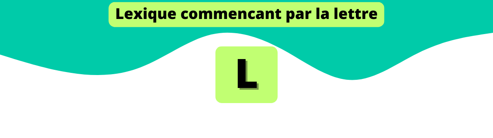




  
    
    ### [{{ page.title | remove: '.md' }}]({{ page.url | relative_url }})
  



  ### Oups...

Il n'y a pas encore de lexique commençant par cette lettre, mais tu peux être le premier à le faire !
Rend toi sur la page [Contribuer](https://github.com/CryptoLexique/CryptoLexique/blob/main/.github/CONTRIBUTING.md) pour commencer l'aventure =)

